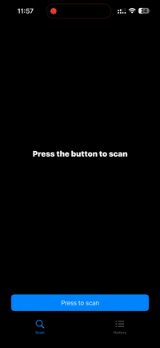

# DeviceScanApp

DeviceScanApp — мобильное приложение, которое сканирует Bluetooth и Lan.
## 🚀 Функциональность

- Сканирование Bluetooth и lan окружения
- Сохранять историю сканирования 
- Просмотерть подробную информацию  

## 🧱 Технологии

- Swift  
- SwiftUI    
- MVVM-архитектура  
- RealmSwift
- Lottie
- CoreBluetooth
- LanScan
- iOS 15+

## 📱 Интерфейс

Приложение содержит:
- Экран сканирования
- Экран подробной информации
- Экран истории сканирования

## 📌 Статус проекта

Проект завершён. Используется как демонстрация навыков при отклике на вакансию.
